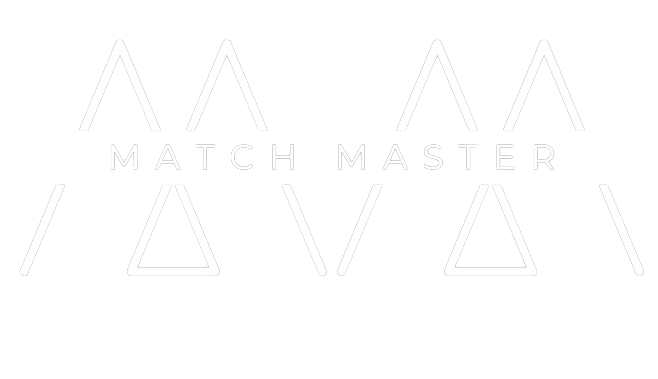

# Match Master - The Tournament Scheduler

## Overview

The Tournament Scheduler is a Python-based application that allows users to manage and simulate a sports tournament. This application provides functionalities for adding teams, scheduling matches, simulating results, and displaying a points table. The project is structured to make use of various data structures like stacks, deques, and graphs for efficient handling and simulation of tournament data. The project has now been converted into a Streamlit web application for an enhanced user interface and experience.

## Scheduling Algorithm

Instead of using standard Round Robin scheduling algorithm, this project used my own made match scheduling algorithm named **PAIR TABLE ALGORITHM**. This algorithm was an inspiration from old version of standard match making which is favourable for "between tournament country travels". This algorithm is the most optimal for fair rest days, home ground plays and reduced inter-country travel

## Concepts used

- Basic Data Structures
- **Fully Connected Undirected Graphs**
- Matching algorithm (made on own)

## Features

- **Add Teams:** Users can add teams along with their home grounds.
- **Schedule Matches:** Matches are scheduled in a round-robin format using a custom scheduling algorithm.
- **Simulate Matches:** Users can input match results to simulate the tournament.
- **Points Table:** Displays the points table sorted by team performance.
- **Last Five Matches:** Shows the last five matches played by each team against which team.
- **Input Validations:** Input validations are done perfectly that there is not need to do through rules. Follow screen instructions

## Project Structure

```plaintext
Root
├── Structures (Folder)
│   ├── Dequeue.py
│   ├── Graph.py
│   ├── PointsTable.py
│   ├── Scheduler.py
│   └── Stack.py
├── Tournament.py
├── README.md
└── streamlit_app.py
```


## Setup and Installation

1. **Clone the Repository:**
    ```sh
    [git clone https://github.com/Astrasv/MatchMaster](https://github.com/Astrasv/MatchMaster.git)
    cd MatchMaster
    ```

2. **Install Dependencies:**
    ```sh
    pip install -r requirements.txt
    ```

3. **Run the Streamlit Application:**
    ```sh
    streamlit run Tournament.py
    ```

